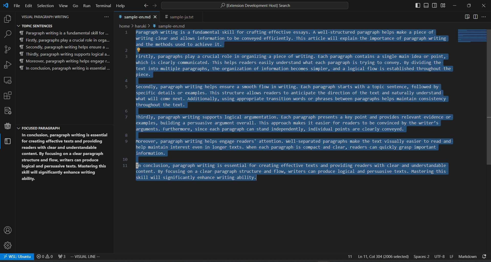
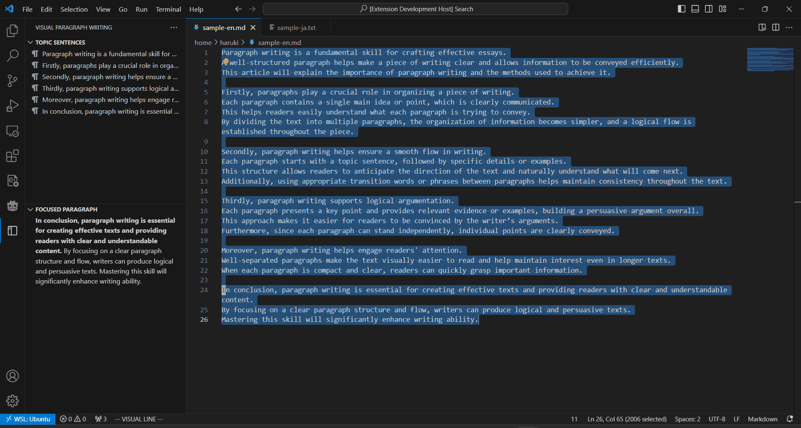
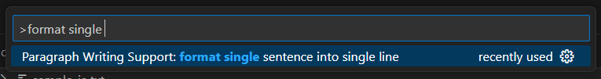

# Paragraph Writing Support

This extension enhances the functionality of "[Visual Paragraph Writing](https://marketplace.visualstudio.com/items?itemName=fukuchiharuki.visual-paragraph-writing)" by providing a command to format text according to its specifications.

このエクステンションは「[Visual Paragraph Writing](https://marketplace.visualstudio.com/items?itemName=fukuchiharuki.visual-paragraph-writing)」の仕様に従ってテキストをフォーマットするコマンドを提供します。

## Features

before:

after:

<!-- en: -->
1. formt one sentence per line

<!-- ja: -->
1. 一行につき一文に整形します

## Usage

<!-- en: -->
1. Open a text file in VS Code.
1. Select the text you want to format.
1. Open the command palette (`Ctrl+Shift+P` or `Cmd+Shift+P` on macOS).
1. Type and select `format one sentence per line`.
1. The selected text will be formatted according to the specifications of [Visual Paragraph Writing](https://marketplace.visualstudio.com/items?itemName=fukuchiharuki.visual-paragraph-writing).

<!-- ja: -->
1. VS Codeでテキストファイルを開きます。
1. フォーマットしたいテキストを選択します。
1. コマンドパレットを開きます（`Ctrl+Shift+P` または macOSでは `Cmd+Shift+P`）。
1. `format one sentence per line`と入力して選択します。
1. 選択したテキストが[Visual Paragraph Writing](https://marketplace.visualstudio.com/items?itemName=fukuchiharuki.visual-paragraph-writing)の仕様に従ってフォーマットされます。

<!--
## Requirements

If you have any requirements or dependencies, add a section describing those and how to install and configure them.
-->

<!--
## Extension Settings

Include if your extension adds any VS Code settings through the `contributes.configuration` extension point.

For example:

This extension contributes the following settings:

* `myExtension.enable`: Enable/disable this extension.
* `myExtension.thing`: Set to `blah` to do something.
-->

<!--
## Known Issues

Calling out known issues can help limit users opening duplicate issues against your extension.
-->
