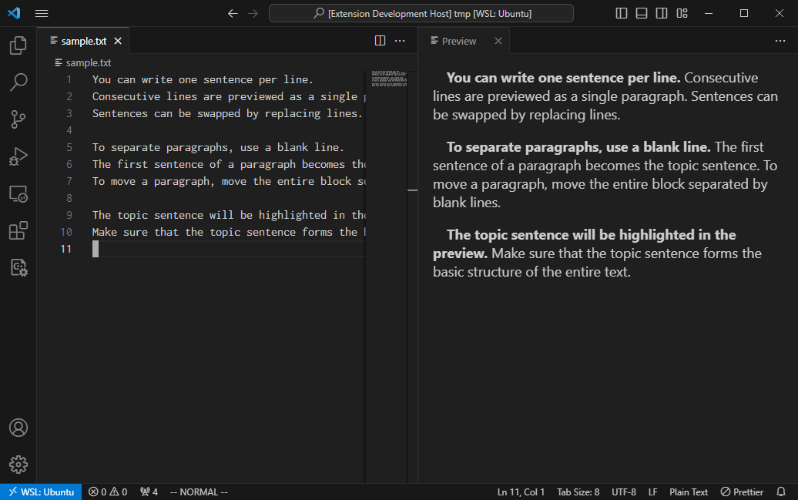

# Paragraph Writing Support

Paragraph wriging support for VS Code.

## Features

You can write sentences while keeping track of topic sentences.
This extension provides a preview with highlighted topic sentences.

You can write one sentence per line.
Consecutive lines are previewed as a single paragraph.
Sentences can be swapped by replacing lines.

To separate paragraphs, use a blank line.
The first sentence of a paragraph becomes the topic sentence.
To move a paragraph, move the entire block separated by blank lines.

The topic sentence will be highlighted in the preview.
Make sure that the topic sentence forms the basic structure of the entire text.

## How to use

1. Focus text-editor pannel
1. Select `Ctrl + Shift + P` to open VS-Code-command palette.
1. Type into the palette `paragraph writing` and
   - `preview` -> topic-sentence highlights
   - `topic sentences` -> bulleted-topic sentences
1. Preview pannel will open.

<!--
## Requirements

If you have any requirements or dependencies, add a section describing those and how to install and configure them.
-->

<!--
## Extension Settings

Include if your extension adds any VS Code settings through the `contributes.configuration` extension point.

For example:

This extension contributes the following settings:

* `myExtension.enable`: Enable/disable this extension.
* `myExtension.thing`: Set to `blah` to do something.
-->

<!--
## Known Issues

Calling out known issues can help limit users opening duplicate issues against your extension.
-->
